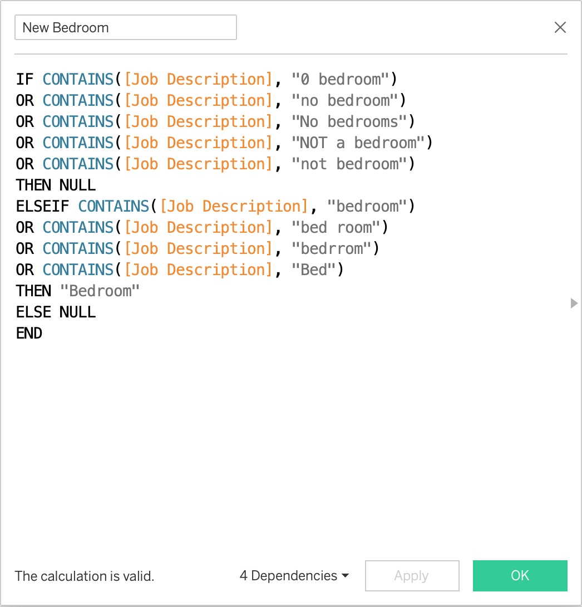

### Confident Short Term Real Estate Investing: Using Building Permit Data to Guide Property Selection and Renovation

#### Abstract
Publicly available data from municipalities can offer valuable market information to short-term property investors (those who purchase properties, make major renovations and resell the house on relatively short time lines, without using the house as a residence). In this example, I use a building permit dataset, a property information dataset, a current property assessment dataset and a historic property assessment dataset from the city of Edmonton, Alberta, Canada to highlight market trends. I used Microsoft Excel, Google Sheets to study, organize, and clean the data. I used Tableau Public to analyze and visualize the data. I identified that the top building permit projects across the city from 2019 to 2022 include the addition or expansion of garages, addition of a utility room, bathroom remodels, bedroom additions, outdoor deck construction, and the construction of secondary suites. Most renovations (excluding exterior projects such as garage additions and outdoor deck construction) are associated with basement developments. Trends can be identified on the neighborhood level. Areas with high variance in property value present good investment opportunities. Short term property investors can add value to the community by performing improvements consistent with building trends in the community, and at the same time can develop a low-risk product with high market desirability.

#### Design
Short term property investors need to know which properties to invest in and which renovations to undertake, in order to construct a property that is valuable to the community and is marketable. They also need to know property value and construction cost trends. This project is designed to create a workflow that uses building permit data (in this case, from the city of Edmonton, Alberta, Canada) to highlight top building projects, as well as price trends to inform property investor decisions. 

The **impact** of this model is to ensure the success of a short term property investment, defined as adding value to the community by creating properties the community needs and wants, and observed in the speedy sell of a post-renovation house at a desired price. 

The **impact hypothesis** is that building permit trends illustrate property buyer desires. Informing property investors of permit project trends allows investors to make confident decisions about which properties to purchase, and what renovations to make. For example, if a trend is identified for a recent increase in permits issued to build spare units, additional data exploration can investigate what kinds of properties or neighborhoods are associated with this increase. An investor can use this information as they proceed with property purchasing and renovations. Another illustrative point, I suspected that many home owners post-COVID, may be constructing work-from-home offices, or rec rooms for families. That does not actually appear to be a notable trend. Instead, expanded garages, outdoor decks, and finished basements are apparently more desirable. 

#### Assumptions and Risks:

A number of assumptions exist in this project. Some **assumptions** include: 
* Property buyers are looking for finished properties (vs properties that can be customized to buyers’ needs, or properties with opportunities for improvement by longer term buyers), and making major improvements could improve property desirability.
* Trends will persist long enough for an improvement to be profitable. 
* Economic stability is a significant assumption. Investments rely on property values increasing over time. 
* Another important assumption is that past behavior is predictive of future behavior—namely, the permit records will be indicative of property owner desires moving forward.

As with any investment, risks exist. **Risks** to this investment approach include: by following market trends, a market could become saturated with a certain kind of property, such that a need for that kind of property decreases; in this case more diverse property types could fetch a higher profit. The risk of an economic downturn occurring exists, or the movement of a population away from a certain area and the devaluing of a property is possible. These are only some of the risks to this proposed approach to real estate investing. 

#### Data

I used freely available data from the City of Edmonton’s open data portal, joining the following datasets on geographic point location (for building permit, property info, and property assessment data) and account number (only used to join historic property assessment data to current calendar year property assessment data):
* [General_Building_Permits.csv](https://data.edmonton.ca/Urban-Planning-Economy/General-Building-Permits/24uj-dj8v)
* [Property_Assessment_Data__Current_Calendar_Year.csv](https://data.edmonton.ca/City-Administration/Property-Assessment-Data-Current-Calendar-Year-/q7d6-ambg)
* [Property_Information__Current_Calendar_Year.csv](https://data.edmonton.ca/City-Administration/Property-Information-Current-Calendar-Year-/dkk9-cj3x)
* [Property_Assessment_Data__Historical.csv](https://data.edmonton.ca/City-Administration/Property-Assessment-Data-Historical-/qi6a-xuwt)

An individual sample unit for this project is either: 
1. A building project permit, its descriptive details and information from joined datasets. 
2. A residential property, its assessed value and other descriptive details. 

#### Tools

I used Microsoft Excel and Google Sheets to view, manage and clean the data. I used predominantly Tableau to visualize and analyze the data.

#### Algorithms

In addition to carefully filtering and visualizing data, many of the valuable results came from extracting information from a field in the Building Permits dataset called "Job Description". This field is a long-form description written in plain language, which makes it difficult to sort, filter, categorize etc. After studying the Job Description field to determine descriptive keywords and formatting, I created a number of calculated fields to extract key words into new Boolean fields for each project type. The following is an example of such a calculated field, used to identify Bedroom Additions. 

#### Future Work 
Plans for future work include using spatial analysis features in Tableau to calculate an average property value within a radius of each point, then visualizing properties that are assessed at 70% or less of that average (which would be valuable for finding properties within the short term property investor's [70% Rule](https://www.rocketmortgage.com/learn/what-is-70-rule-in-house-flipping#:~:text=The%2070%25%20rule%20helps%20home,costs%20of%20renovating%20the%20property.)). I also plan to fine tune visualizations for maximum readability and utility. 

#### Communication

Please see accompanying presentation slides and [this Tableau Dashboard](https://public.tableau.com/app/profile/jenica.andersen/viz/EdmontonABShortTermPropertyInvestingInsightsUsingBuildingPermitData/Dashboard1?publish=yes) for additional results and information regarding this project. 
